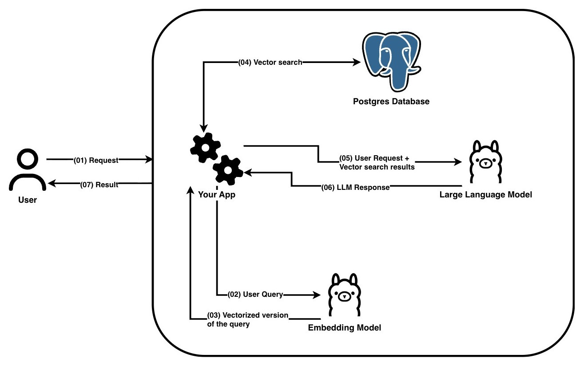
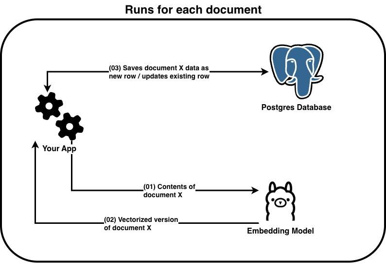
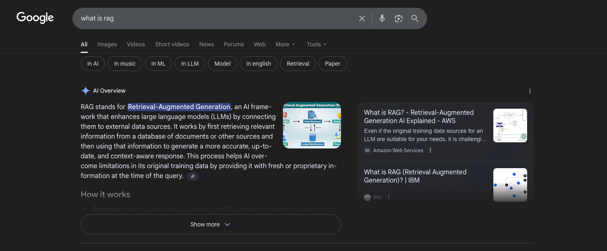

# Local RAG Example
This repository contains an explaination on how the RAG (Retrieval-Augmented Generation) architecture works and some [examples](./examples/readme.md).

## Explaination
Retrieval-Augmented Generation (RAG) is a popular alternative to fine-tuning large language models, it allows for more flexible content generation by leveraging pre-trained models and a retrieval mechanism.
Content is stored on a database, relevant information to the user query can be found by transforming the query in a vector and using a vector search on a database to find the most relevant data to what the user is talking about.
By storing the data on a database you can easly obtain it without training a model each time the data changes.

### Request diagram

This diagram shows how the reuqest from the user is handled.

### Seed diagram

This diagram shows how data is stored for quick and precise retrieval.

## Google's AI Overview
A popular example of RAG is Google's new AI Overview tool.

When you search for something on Google the overview tool takes the top results from the search and **tries to answer to your question using a RAG system**.

This is a perfect usecase for RAG, the data that is being fetched from search results is constantly changing, it would be impossible to train the model on new data each time someone makes an update, RAG allows more flexibility at the small cost of performance.

### Help
If you happen to have any questions feel free to open a [GitHub issue](github.com/Franky5831/Local-rag-example/issues/new), I'd be happy to help.

 

---

This repo takes great inspiration from [Private rag example](https://github.com/timescale/private-rag-example) by Timescale.
